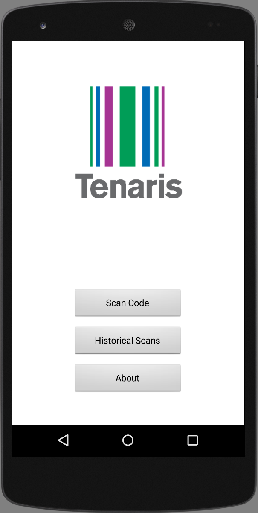

# TenarisBarCodeLocator 

A basic barcode scanner application using a SQLite database to store scanned products information along with comments on the product.

The main goal of the app was to digitize warehouse operators daily logs to facilitate data analysis and improve daily processes.
